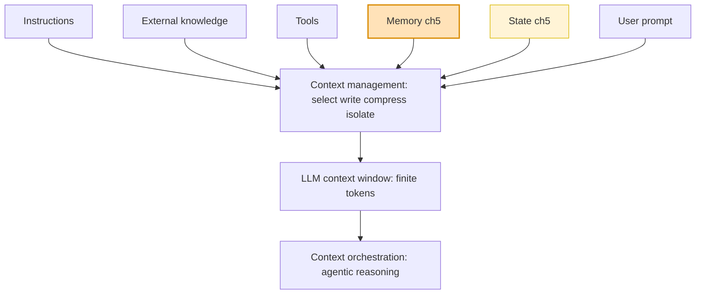
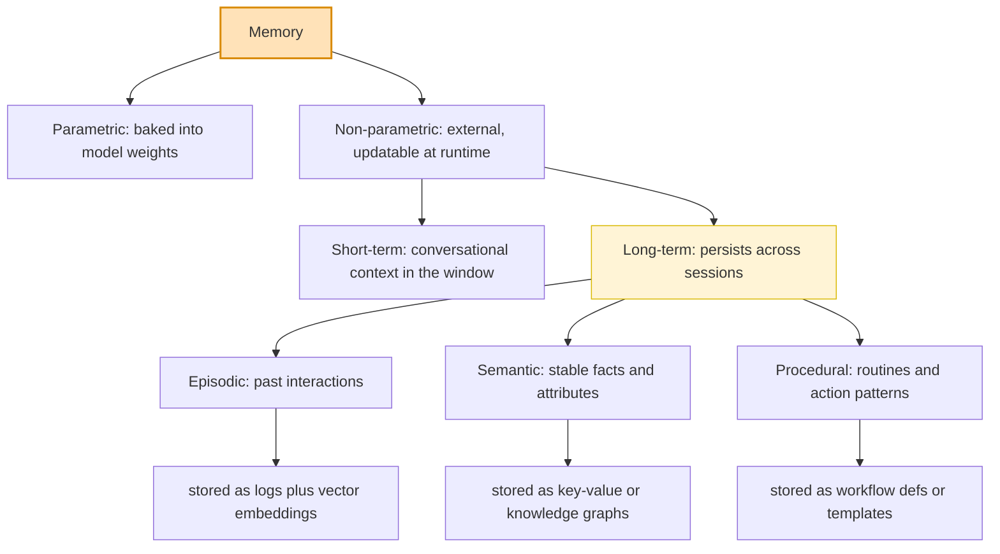
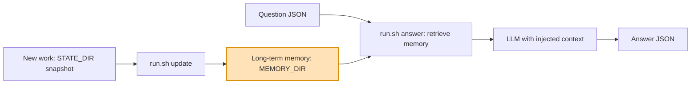

# How Context Engineering frames Memory

Source: Context Engineering (Manning MEAP v1, Boni Garcia) — Ch. 1 taxonomy and
section 1.5.4 Memory. Memory gets its own chapter (Ch. 5) and is one of six
context sources.

---

## 1. Where memory sits in the stack

Context engineering picks the smallest set of high-signal tokens that still lets
the model behave as intended. Memory is one input among six; a context manager
curates all six into the finite context window.

Why memory exists: LLMs are stateless, so each API call is independent. Memory is
the technique that turns a series of stateless exchanges into a continuous,
stateful conversation.

---

## 2. The memory taxonomy itself (section 1.5.4)

At runtime, relevant fragments are retrieved from these external stores and
injected into the context window. The model stays stateless; the system appears
to remember.

---

## 3. The write / retrieve loop and how engram-kit maps onto it

Memory is two operations: write (persist what is worth keeping) and retrieve
(surface the relevant slice into context). This kit's two commands are exactly
those operations.

| Book concept (1.5.4)       | engram-kit equivalent                          |
|----------------------------|------------------------------------------------|
| Write to long-term memory  | run.sh update STATE_DIR MEMORY_DIR             |
| Retrieve and inject        | run.sh answer with QUESTION_JSON ANSWER_JSON   |
| External store             | MEMORY_DIR                                      |
| Episodic source            | dated sample_states snapshots plus git log      |
| Evaluation harness         | check_submission.py and scoring                 |

---

Tip: GitHub, VS Code, and most Markdown viewers render the Mermaid blocks above
inline. For slides, paste a block into https://mermaid.live to export SVG or PNG.
