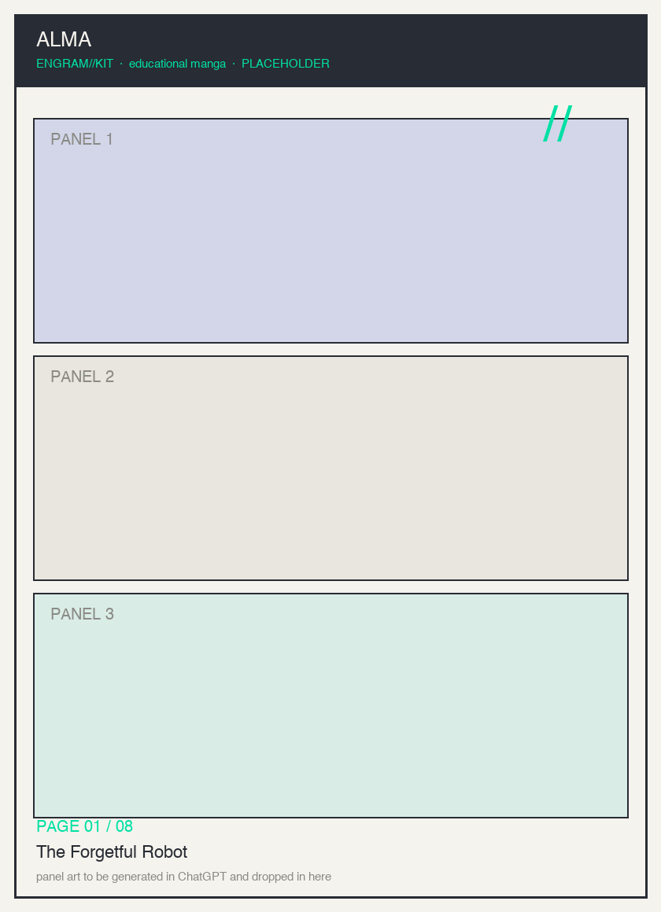
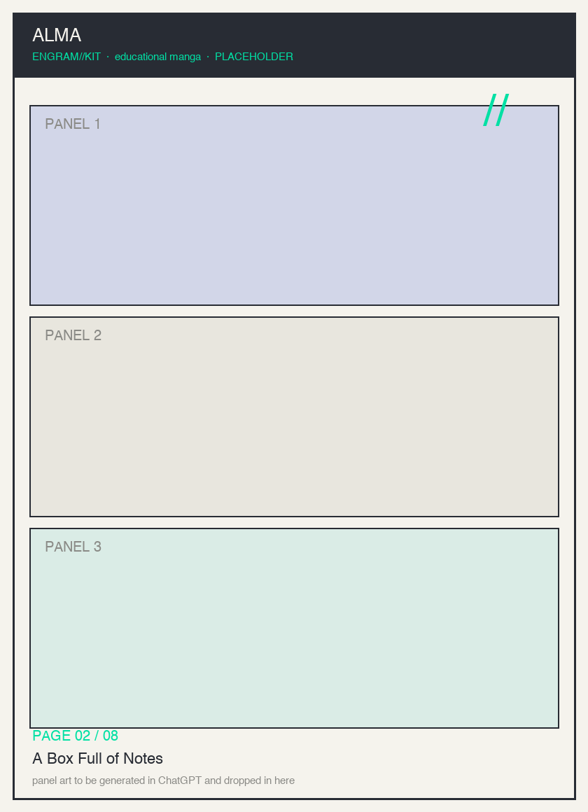
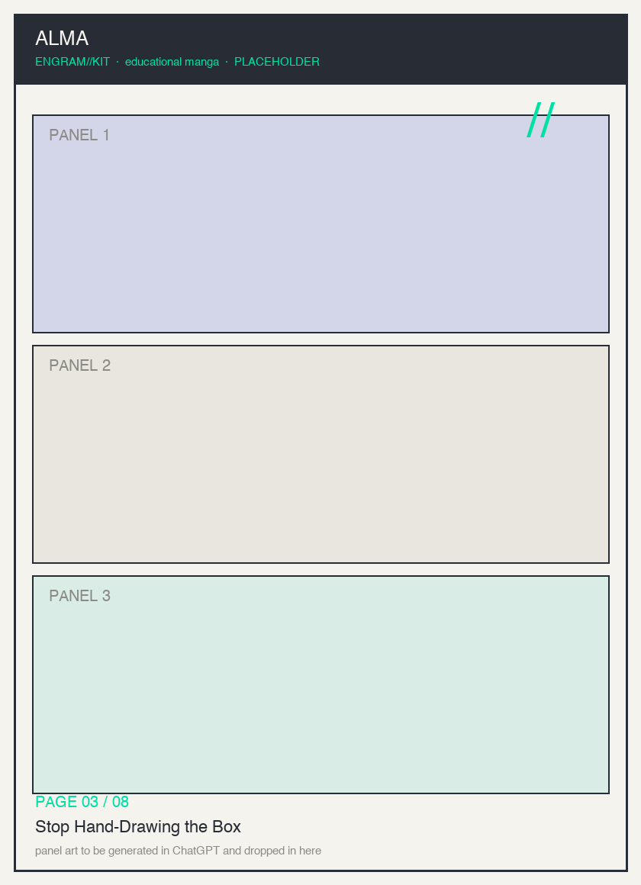
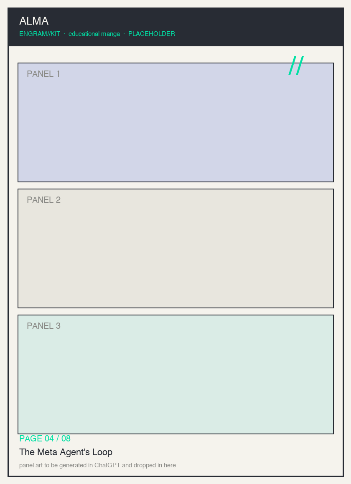
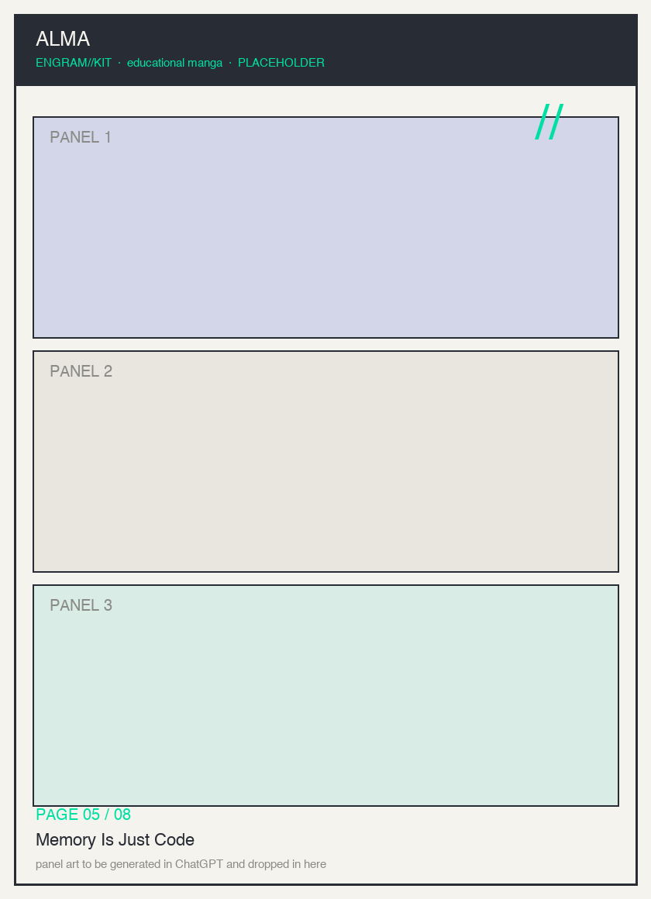
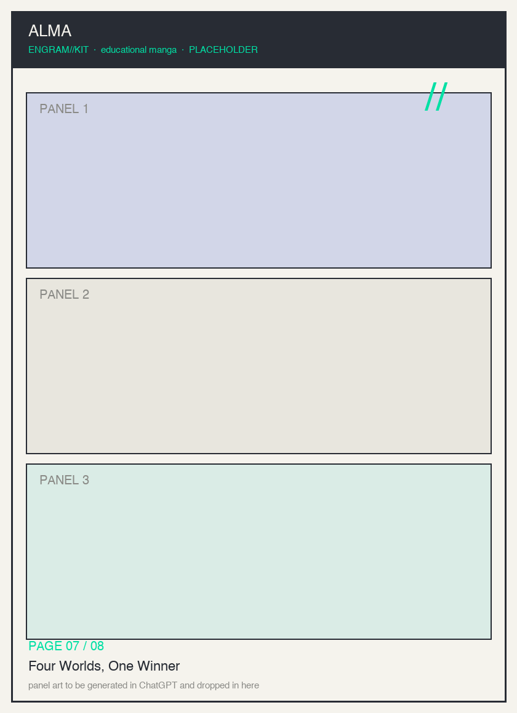
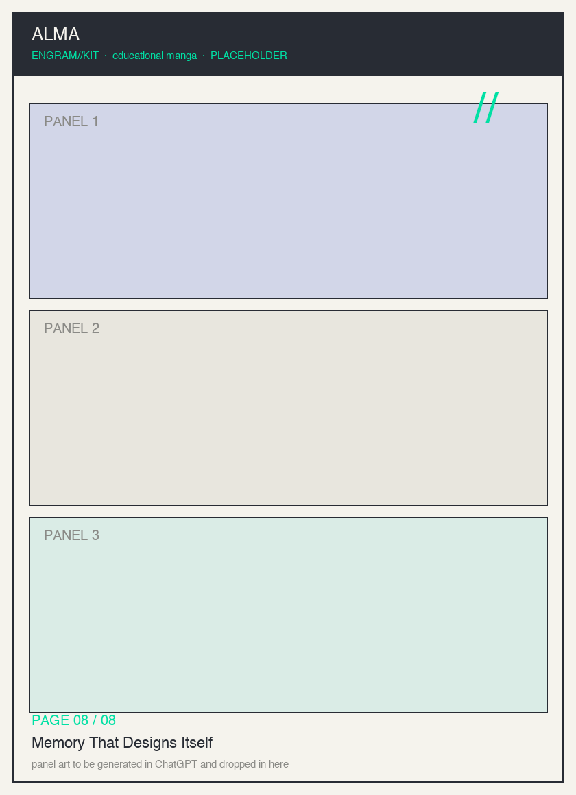

# ALMA — Meta-learning Agentic Memory Designs — Educational Manga

**Title:** *The Notebook That Redesigns Itself* — an ALMA explainer in soft-color manga
**Author / Source:** "Learning to Continually Learn via Meta-learning Agentic Memory Designs"
**Authors:** Yiming Xiong, Shengran Hu, Jeff Clune (UBC · Vector Institute · CIFAR)
**Source URL / id:** [arXiv 2602.07755v1](https://arxiv.org/abs/2602.07755) · code: https://github.com/zksha/alma

## Summary

Foundation models are **stateless**, which bottlenecks an agent's ability to keep
learning over a long task. Agents usually fix this by bolting on a **memory
module** — but those modules are **hand-crafted and fixed**, so they can't adapt to
the diversity and non-stationarity of real tasks. **ALMA** (Automated meta-Learning
of Memory designs for Agentic systems) replaces the hand engineering: a **Meta
Agent** searches over memory *designs* written as **executable code** — database
schemas plus their retrieval and update mechanisms — in an open-ended loop. It
samples a design from an **archive**, reflects on its code and evaluation log,
plans and implements a new design, verifies and evaluates it on real agentic tasks,
then stores the result back in the archive. Across four sequential decision-making
domains (ALFWorld, TextWorld, Baba Is AI, MiniHack), the learned designs beat
state-of-the-art human-crafted memory baselines — and are more cost-efficient. The
framing: a step toward self-improving, continually-learning AI, *when developed and
deployed safely.*

## Read the manga

A print-ready PDF of all eight pages lives at [`pdf/alma-manga.pdf`](pdf/alma-manga.pdf) (placeholder until panels are rendered).

### Page 1 — The Forgetful Robot
Foundation models are stateless; without memory Engy re-solves the same task from scratch every time.

### Page 2 — A Box Full of Notes
The common fix: a memory module so Engy can store and reuse past experience.

### Page 3 — Stop Hand-Drawing the Box
Human-crafted memory designs are fixed; they fit one task and break on the next.

### Page 4 — The Meta Agent's Loop
ALMA meta-learns the design itself: Sample → Reflect → Plan → Implement → Verify → Evaluate → Archive.

### Page 5 — Memory Is Just Code
The search space is executable code — schemas, retrieval, and update mechanisms — so the design space is unbounded.

### Page 6 — The Design Archive
Sample past designs and their evaluation logs to seed the next idea; better designs propagate.

### Page 7 — Four Worlds, One Winner
Across ALFWorld, TextWorld, Baba Is AI, and MiniHack, learned designs beat human-crafted baselines and cost less.

### Page 8 — Memory That Designs Itself
A step toward self-improving, continually-learning AI — safely — and exactly the kind of memory ENGRAM asks you to build.

## Key concepts

1. Statelessness bottlenecks continual learning.
2. Memory modules store and reuse experience.
3. Fixed, hand-crafted designs don't generalize.
4. ALMA meta-learns the memory design via an open-ended Meta-Agent loop.
5. Code is the search space (schema + retrieval + update).
6. An archive of designs + evaluation logs guides the search.
7. Learned designs win across four domains, more cost-efficiently.
8. A safe step toward self-improving memory — the ENGRAM challenge made concrete.

## Total page count

8 pages (`page-01.md` … `page-08.md`).

## Character list

- **Engy** — the learner; a librarian-robot whose chest-notebook is its memory.
- **Sensei** — the teacher / narrator who frames each lesson.
- **The Meta Agent** — ALMA itself; the architect-of-light who redesigns memory as code.
- **The Archive** — the glowing wall of past designs + evaluation logs.

See `character-sheet.md` for full, consistent descriptions used across all pages.

## Pipeline

Generate each page in an image model from its `page-XX.md` prompt → save to
`panels/alma_pageNN.png` (zero-padded) → optionally run the `manga-pdf-generator`
skill to build `pdf/alma-manga.pdf`.
