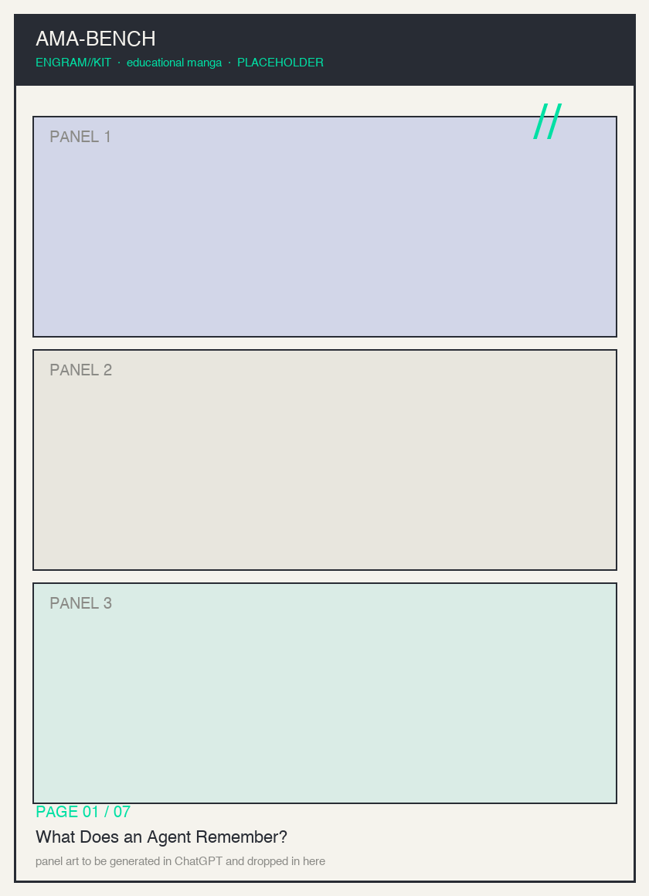
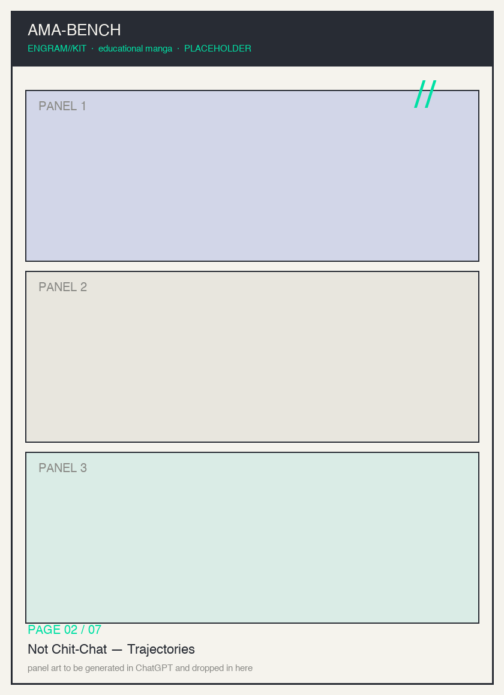
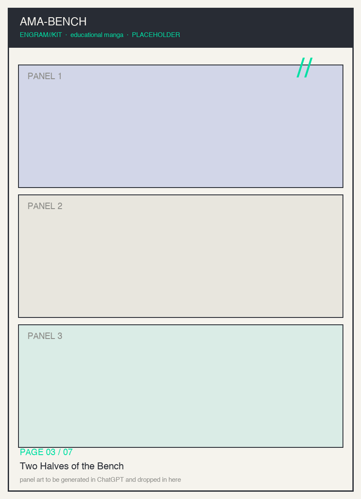
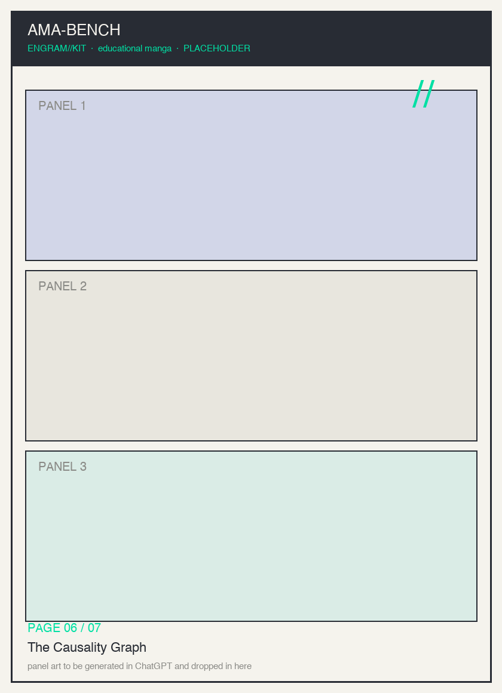
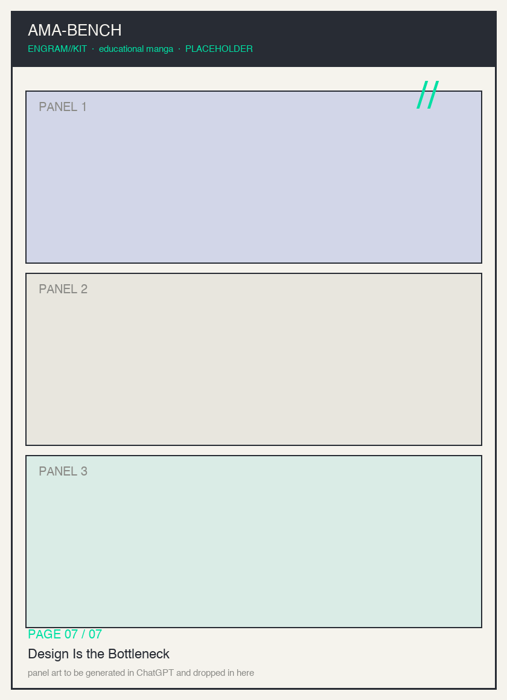

# AMA-Bench — Long-Horizon Memory for Agentic Applications — Educational Manga

**Title:** *The Long Road Test* — an AMA-Bench explainer in soft-color manga
**Author / Source:** "AMA-Bench: Evaluating Long-Horizon Memory for Agentic Applications"
**Authors:** Yujie Zhao, Boqin Yuan, Junbo Huang, Haocheng Yuan, Zhongming Yu, Haozhou Xu, Lanxiang Hu, Abhilash Shankarampeta, Zimeng Huang, Wentao Ni, Yuandong Tian, Jishen Zhao
**Source URL / id:** [arXiv 2602.22769v4](https://arxiv.org/abs/2602.22769) · project: https://ama-bench.github.io/

## Summary

LLM agents increasingly run **long-horizon** tasks — navigation, code editing, web
search — where **memory** is what keeps them coherent. But existing memory benchmarks
are mostly **dialogue-centric**, while real agent memory is a **trajectory**: states,
actions, observations, and tool outputs, which are machine-generated (JSON, ASCII
tables, code), causally linked, and objective (no chit-chat). **AMA-Bench** ("Agent
Memory with Any length") fixes the mismatch with two subsets: a **real-world** subset
of expert-annotated QA across six domains (Web, open-world QA, Text2SQL, software
engineering, gaming, embodied AI), and a **synthetic** subset whose rule-based QA
scales to any horizon. It probes four question types — **Temporal Information, State
Dependency, Memory Updating, Memory Summarization**. The finding: agent memory is hard
even for frontier models (GPT-5.2 ≈ 72%), and the bottleneck is **memory-system
design**, not base-model capability — lossy compression and similarity-only retrieval
miss the causal, objective information. Their system, **AMA-Agent**, builds a
**causality graph** and uses **tool-augmented retrieval**, reaching **57.22%** accuracy,
**+11.16%** over the strongest baseline.

## Read the manga

A print-ready PDF of all seven pages lives at [`pdf/ama-bench-manga.pdf`](pdf/ama-bench-manga.pdf) (placeholder until panels are rendered).

### Page 1 — What Does an Agent Remember?
Long-horizon agents live or die by their memory. Engy sets out on a very long road.

### Page 2 — Not Chit-Chat — Trajectories
Real agent memory is a causal, machine-generated trajectory — not a conversation.

### Page 3 — Two Halves of the Bench
A real-world subset (six domains) plus a synthetic subset that scales to any horizon.

### Page 4 — Four Kinds of Question
Temporal Information, State Dependency, Memory Updating, Memory Summarization.

### Page 5 — Why Memory Breaks
Lossy compression and similarity-only retrieval miss causal, objective information.

### Page 6 — The Causality Graph
AMA-Agent builds a causality graph + tool-augmented retrieval — 57.22%, +11.16%.

### Page 7 — Design Is the Bottleneck
It's the memory-system design, not model size — and that's the heart of ENGRAM.

## Key concepts

1. Long-horizon agents depend on memory.
2. Real agent memory is a trajectory, not dialogue.
3. AMA-Bench = real-world (6 domains) + scalable synthetic subsets.
4. Four question categories probe different failure modes.
5. Similarity-only retrieval misses causal & objective info; even frontier models struggle.
6. AMA-Agent: causality graph + tool-augmented retrieval wins.
7. Design is the bottleneck — the ENGRAM challenge made concrete.

## Total page count

7 pages (`page-01.md` … `page-07.md`).

## Character list

- **Engy** — the agent under test; a librarian-robot whose chest-notebook is its memory.
- **Sensei** — the teacher / narrator who frames each lesson.
- **The Examiner** — the benchmark personified; holds the four-sealed question-cards.
- **The Long Road** — the agent's trajectory of machine-generated, causally-linked scrolls.

See `character-sheet.md` for full, consistent descriptions used across all pages.

## Pipeline

Generate each page in an image model from its `page-XX.md` prompt → save to
`panels/amabench_pageNN.png` (zero-padded) → optionally run the `manga-pdf-generator`
skill to build `pdf/ama-bench-manga.pdf`.
